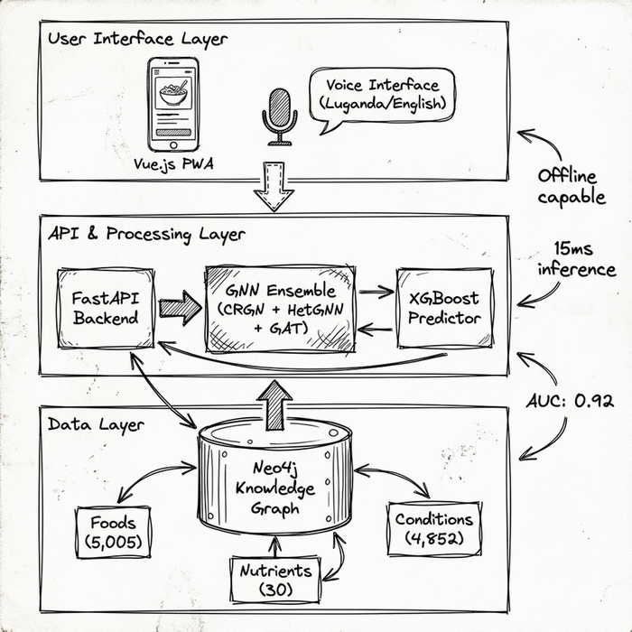

# Welcome to MzeeChakula

**MzeeChakula** (Swahili for "Elderly Food") is an AI-powered nutrition planning system designed specifically for the elderly population in Uganda. It combines Graph Neural Networks (GNNs) with local knowledge to provide personalized, culturally appropriate meal recommendations.

-   :material-robot: **AI-Powered**
    ---
    Uses an ensemble of 9 Graph Neural Networks to predict optimal nutrition plans.

-   :material-food-apple: **Culturally Aware**
    ---
    Built on a knowledge graph of local Ugandan foods, cultural practices, and seasonal availability.

-   :material-account-heart: **Elderly Focused**
    ---
    Tailored for specific health conditions like hypertension, diabetes, and frailty common in the elderly.

-   :material-api: **Modern Stack**
    ---
    FastAPI backend, Vue 3 frontend, and Neo4j graph database.

## Project Goals

1.  **Combat Malnutrition**: Address the 28% undernourishment rate among Uganda's elderly.
2.  **Personalization**: Move beyond generic advice to specific, actionable meal plans.
3.  **Accessibility**: Provide a voice-enabled interface for ease of use.

## Quick Start

Check out the [Project Setup](setup.md) guide to get the application running locally.

## Architecture Overview

The system consists of three main components:

1.  **Knowledge Graph**: A comprehensive map of foods, nutrients, and conditions.
2.  **GNN Ensemble**: Models that reason over the graph to generate recommendations.
3.  **Application Layer**: A user-friendly interface for interaction.

