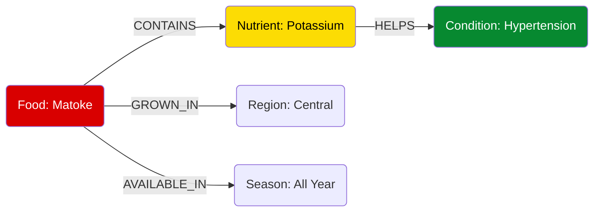

# Knowledge Graph

The **MzeeChakula Knowledge Graph (KG)** is the semantic brain of our system. Unlike traditional databases that store data in rows and columns, our KG stores data as **entities (nodes)** and **relationships (edges)**, allowing the AI to reason about connections between food, health, and culture.

## Ontology & Schema

The graph follows a strict ontology designed to capture the complexities of elderly nutrition in Uganda.

### Core Entities (Nodes)

| Entity | Description | Examples | Count |
| :--- | :--- | :--- | :--- |
| **Food** | Local food items available in Uganda. | `Matoke`, `Millet Porridge`, `Nile Perch` | 5,005 |
| **Nutrient** | Micro and macronutrients. | `Vitamin A`, `Iron`, `Protein` | 30 |
| **Condition** | Health conditions affecting the elderly. | `Hypertension`, `Type 2 Diabetes` | 4,852 |
| **Region** | Geographic regions of Uganda. | `Central`, `Northern`, `Western` | 5 |
| **Season** | Time periods affecting availability. | `Dry Season`, `Wet Season` | 12 |
| **Culture** | Cultural groups and practices. | `Baganda`, `Acholi` | 8 |

### Core Relationships (Edges)

The power of the KG lies in how these entities are connected:

-   **`Food -[CONTAINS]-> Nutrient`**
    -   *Properties*: `amount` (per 100g), `unit` (mg, g, ug).
    -   *Usage*: Allows the system to calculate the nutritional value of a meal.

-   **`Nutrient -[AFFECTS]-> Condition`**
    -   *Properties*: `impact` (Positive/Negative), `mechanism` (e.g., "Raises blood pressure").
    -   *Usage*: The core reasoning path. If *Salt* `AFFECTS` *Hypertension* negatively, and *Chips* `CONTAINS` *Salt*, the system infers *Chips* are bad for *Hypertension*.

-   **`Food -[AVAILABLE_IN]-> Season`**
    -   *Usage*: Ensures recommendations are practical. We won't recommend mangoes when they are out of season.

-   **`Food -[CULTURALLY_RELEVANT]-> Culture`**
    -   *Usage*: Personalization. A Muganda elder might prefer Matoke, while an Acholi elder might prefer Millet.

## Reasoning Capabilities

The Knowledge Graph enables several types of advanced reasoning:

### 1. Multi-Hop Reasoning
The system can traverse multiple edges to find indirect connections.
> **Query**: "What should I eat for Anemia?"
> **Path**: `Anemia` <---(treats)--- `Iron` <---(contains)--- `Liver`
> **Result**: Recommend Liver.

### 2. Negative Inference
The system understands what *not* to recommend.
> **Query**: "I have High Blood Pressure."
> **Path**: `Hypertension` <---(worsens)--- `Sodium` <---(contains)--- `Salted Fish`
> **Result**: Avoid Salted Fish.

### 3. Contextual Filtering
Combining health needs with environmental constraints.
> **Query**: "Recommend a fruit for Vitamin C in January."
> **Path**: `Vitamin C` <---(contains)--- `Orange` ---(available_in)---> `January`
> **Result**: Recommend Orange (if available).

## Graph Construction

The graph was built using a semi-automated pipeline:

1.  **Data Ingestion**: Structured data from food composition tables (FAO) and medical guidelines (WHO).
2.  **Entity Linking**: Mapping local food names (e.g., "Posho") to standardized ontology terms (e.g., "Maize Meal").
3.  **Graph Projection**: Stored in **Neo4j** for querying and exported as **PyTorch Geometric** tensors for GNN training.

## Visualization

Below is a simplified visualization of a subgraph centered around "Matoke":

